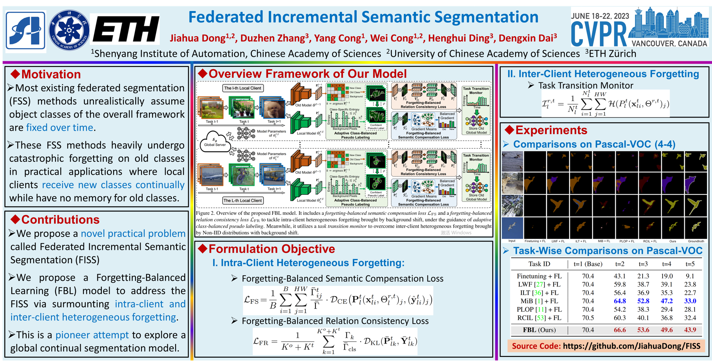

# Pytorch Implementation for FBL

## [[CVPR-2023] Federated Incremental Semantic Segmentation](https://openaccess.thecvf.com/content/CVPR2023/html/Dong_Federated_Incremental_Semantic_Segmentation_CVPR_2023_paper.html)

This is the official implementation code of our paper "**Federated Incremental Semantic Segmentation**" accepted by [CVPR-2023](https://cvpr2023.thecvf.com/). 

You can also find the arXiv version with supplementary material at [here](https://arxiv.org/pdf/2304.04620.pdf).

This repository contains all of our source code. We sincerely thank the help of other repositories:
[Cermelli et al.'s repository](https://github.com/fcdl94/MiB), [Douillard et al.'s repository](https://github.com/arthurdouillard/CVPR2021_PLOP), and [Zhang et al.'s repository](https://github.com/zhangchbin/RCIL).

## Framework



### Requirements

- Python (3.6.13)
- Pytorch (1.7.1+cu110)
- torchvision (0.8.2+cu110)
- apex (0.1)
- matplotlib (3.3.4)
- numpy (1.19.5)
- [inplace-abn](https://github.com/mapillary/inplace_abn) (1.1.0 or 1.1.1.dev6+gd2728c8)
- Memory $\geq$ 35G (recommend NVIDIA A100)


**Recommend:** You can directly use our encapsulated files [(FCIL.zip)](https://drive.google.com/file/d/1t3n8JH4L6HmjPPt0u-BMrt3wMh4YbdPQ/view?usp=sharing) to create an environment. The steps are as follows:
````
1) unzip FCIL.zip
2) conda create -n FCIL --clone ./FCIL
3) pip uninstall matplotlib
4) pip install matplotlib==3.3.4
````


### Dataset

Two scripts are available to download ADE20k and Pascal-VOC 2012, please see in the `data` folder.


### How to perform training

The default is to use a pretraining for the backbone used, that is searched in the pretrained folder of the project.
We used the pretrained model released by the authors of In-place ABN, that can be found here:
[link](https://github.com/arthurdouillard/CVPR2021_PLOP/releases/download/v1.0/resnet101_iabn_sync.pth.tar)(place the downloaded "resnet101_iabn_sync.pth.tar" in the "pretrained" folder of the project).

We also provided 4 trained [base models](https://drive.google.com/file/d/1eGF2p8sFZcmlv-cYGmtDZGxSB1H1PbZb/view?usp=sharing) corresponding to the 4 settings used in our paper (i.e., VOC 4-4/8-2/10-1, ade 100-10)(place the downloaded base models in the "checkpoints/seed_2023-ov" folder of the project). Your future development can be directly based on our trained base models, just add "--base_weights" option to your own shell scripts.


#### Example commands

````
nohup bash scripts/voc/ours_4-4_overlap.sh >logs/voc/ours_4-4_overlap.log 2>&1 &
nohup bash scripts/ade/ours_100-10_overlap.sh >logs/ade/ours_100-10_overlap.log 2>&1 &
````


## Our Related Works

Some related works about this topic are listed as follows:

1. [[CVPR-2022] Federated Class-Incremental Learning](https://openaccess.thecvf.com/content/CVPR2022/html/Dong_Federated_Class-Incremental_Learning_CVPR_2022_paper.html) [[Code]](https://github.com/conditionWang/FCIL)

2. [[TPAMI-2023] No One Left Behind: Real-World Federated Class-Incremental Learning](https://arxiv.org/abs/2302.00903v1) (Under Review) [[Code]](https://github.com/jiahuadong/lga)


## Citations:

If you find this code is useful to your research, please consider to cite our papers.

```
@InProceedings{dong2023federated_FISS,
    author = {Dong, Jiahua and Zhang, Duzhen and Cong, Yang and Cong, Wei and Ding, Henghui and Dai, Dengxin},
    title = {Federated Incremental Semantic Segmentation},
    booktitle = {Proceedings of the IEEE/CVF Conference on Computer Vision and Pattern Recognition (CVPR)},
    month = {June},
    year = {2023},
    pages = {3934-3943}
}
```
```
@InProceedings{dong2022federated_FCIL,
    author = {Dong, Jiahua and Wang, Lixu and Fang, Zhen and Sun, Gan and Xu, Shichao and Wang, Xiao and Zhu, Qi},
    title = {Federated Class-Incremental Learning},
    booktitle = {IEEE/CVF Conference on Computer Vision and Pattern Recognition (CVPR)},
    month = {June},
    year = {2022},
}
```
```
@InProceedings{Dong2023_LGA,
    author = {Dong, Jiahua and Cong, Yang and Sun, Gan and Zhang, Yulun and Schiele, Bernt and Dai, Dengxin},
    title = {No One Left Behind: Real-World Federated Class-Incremental Learning},
    booktitle = {arXiv preprint arXiv:2302.00903},
    month = {Feb.},
    year = {2023},
}
```

## Contact:

* **Jiahua Dong:** dongjiahua1995@gmail.com
